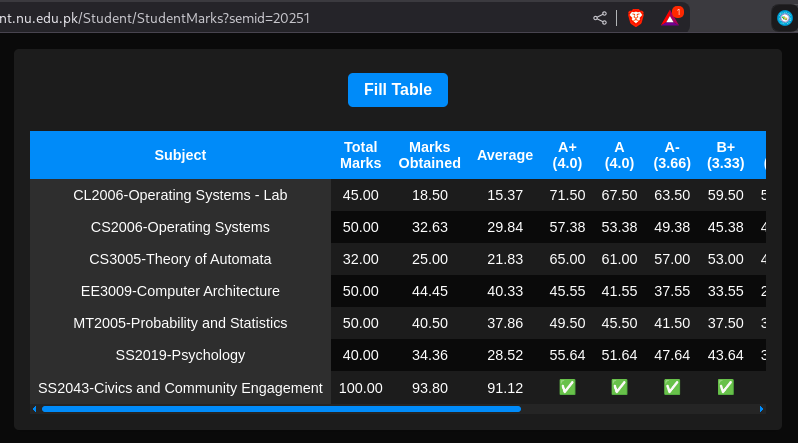

# What Flex Should Show

**What Flex Should Show** is a browser extension designed for FAST-NUCES students. It enhances the **Flex** student portal by showing your marks in a detailed table format. The extension helps you easily understand how many marks you need to achieve your desired grade.

---

## 📸 What It Looks Like

---

## 🚀 Features

- Automatically reads and formats your marks from the Flex portal
- Helps you track your progress and predict your final grade

---

## 🧩 How to Install

1. **Download** the source files (ZIP).
2. **Extract** the ZIP file to a folder.
3. Open **Google Chrome** or any Chromium-based browser (like Edge or Brave).
4. Click the **Extensions** icon (top-right of the browser).
5. Click **"Manage Extensions"**.
6. In the top-right corner, enable **Developer mode**.
7. Click on **Load unpacked**.
8. Select the **extracted folder**.

The extension should now appear in your browser's extension bar.

---

## 📝 How to Use

1. Go to the [FAST Flex Portal](https://flexstudent.nu.edu.pk/).
2. Log in and navigate to the **Marks** tab.
3. Click on the **What Flex Should Show** extension icon in your browser.
4. Click the **"Fill the Table"** button.

You should now see a detailed breakdown of your marks and remaining evaluations.

---

## 📢 Disclaimer

This extension is not officially affiliated with or endorsed by FAST-NUCES or the Flex Portal. Use it at your own discretion.

---

### Special Mention

Special mention: [Wahaj Javed](https://github.com/wahajjaved20)'s [FlexMan](https://github.com/WahajJaved20/The-Amazing-Flex_Man)